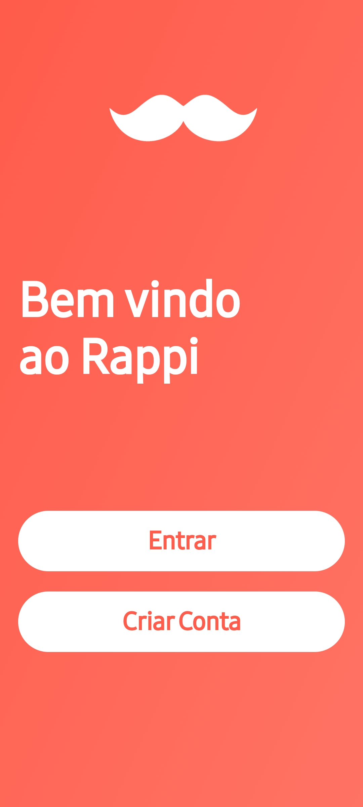
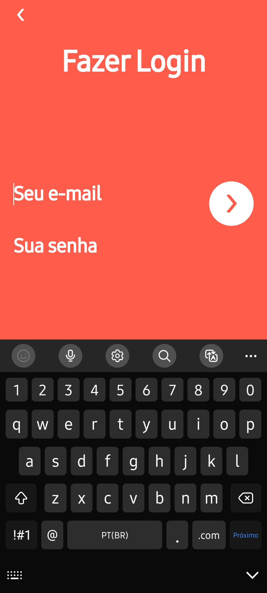
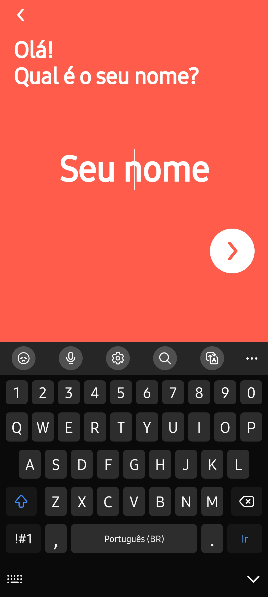
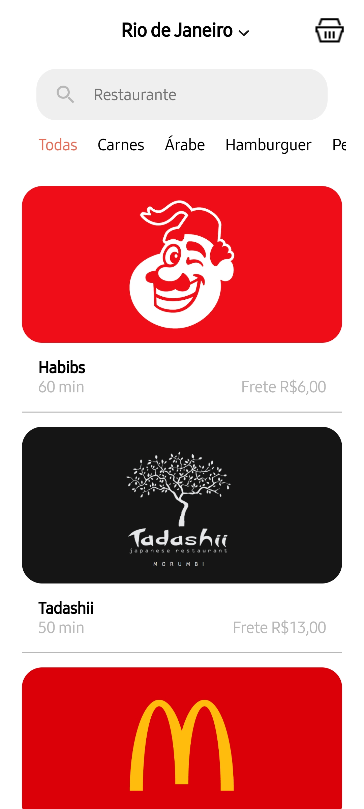
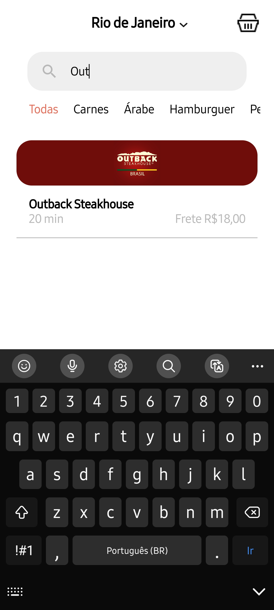
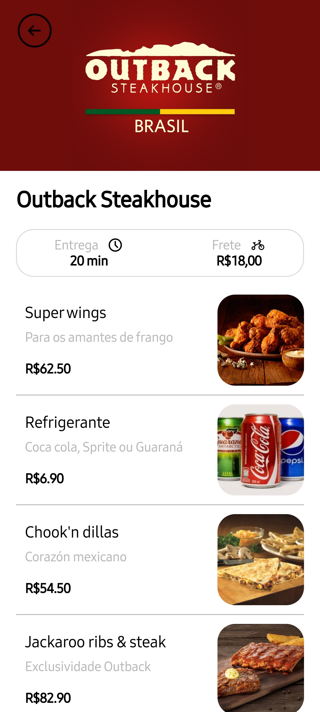
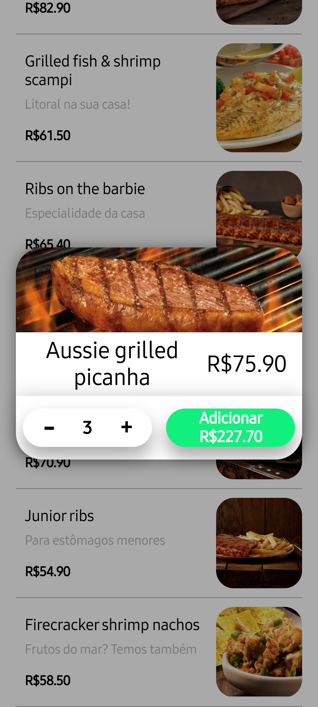
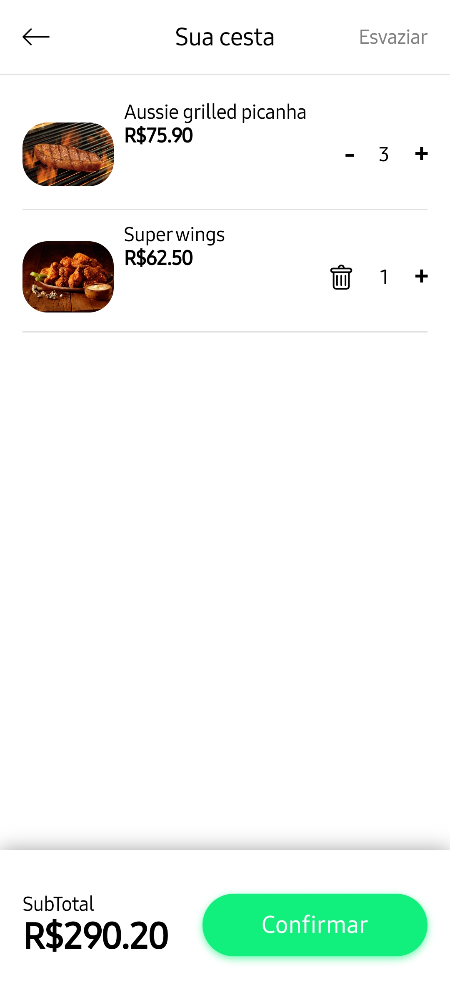

# `Projeto`
Projeto Rappi

# `Link`
http://lively-badge.surge.sh/

# `Descrição`
O projeto é um aplicativo de delivery de comida, com várias funcionalidades, desde pesquisar por restaurantes até o carrinho.
  
Utilizando tecnologias como React, JS, HTML e CSS, desenvolvi todo o front-end, inspirado no já estabelecido "Rappi".

# `Instalando e rodando o projeto`
Fazer o clone do projeto:
- git clone link-do-repositório

Instalar as dependências:
- npm install

Rodar o projeto:
- npm run start

# `Tecnologias utilizadas`

# `Imagens`
### Página Inicial

### Login

### Cadastro

### Home

### Busca por restaurante

### Página do restaurante

### Adicionar ao carrinho

### Carrinho

